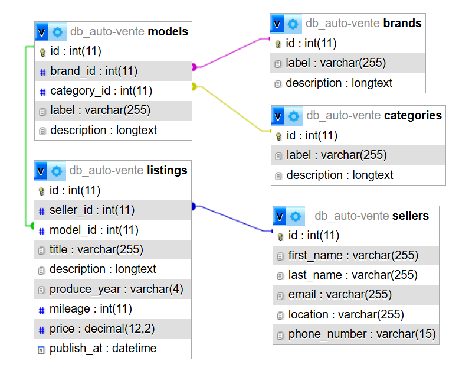

# PHP OBJET

Rappels :
- URL DB : http://localhost:8080/
- URL serveur PHP : http://localhost:8000/src/index.php


## 1. Exo centraleish


Finaliser les classes nécessaires pour la base de données Centraleish.



Toutes les classes doivent :
- Se trouver dans le dossier `tp/Entity`
- Avoir les attributs `private`
- Avoir les accesseurs de créer en `public`
- Ne pas avoir de constructeur déclaré (constructeur vide)
- Tester dans chaque classe (via un `dump` une instance de votre classe)


## 2. Traits


Reprendre les classes de la centralish, en ajoutant les traits que vous jugerez nécessaires.


## 3. PokemonRepository


L'objectif de cette classe est de : permettre l'accès à toutes les méthodes permettant d'interroger la table `Pokémon`

Méthodes ou attributs nécessaires :

- Un PDO ?
```php
$pdo = new PDO(
    'mysql:127.0.0.1;dbname=db_pokemons;charset=utf8;port=3306',
    'root',
    'root'
);
```
 
- `fetchAll`: Récupère toutes les donées de la table `pokemon`
- `fetchById`: Récupère un `pokemon` en passant son id
- `deleteById`: Supprime un `pokemon` en passant son id

<br>

- Astuce : `$stmt->fetch(PDO::FETCH_ASSOC);`, il existe une alternative au `PDO::FETCH_ASSOC` qui permet de récupérer des objets
- Alternative (peut-être plus intéressante pour pratquer l'objet) : récupérer le tableau associatif, et instanciez vous-même les objets en sortie...

<br>
- Résultat attendu :

```php
$repository = new PokemonRepository();

/** @var array<Pokemon> $pokemons */
$pokemons = $repository->fetchAll();

/** @var Pokemon $pokemon */
$pokemon = $repository->fetchById(473);
```

## 4. De la géométrie...


- Créer une classe abstraite `AbstractForm`
- Elle doit avoir aucun attributs !
- Elle aura une méthode abstraite `getArea` qui renvoie un `float`
<br><br>
- Créer ensuite une classe `Square` avec un attribut `width`
- Redéfinir la méthode `getArea` pour qu'elle effectue le calcul correct de l'aire d'un Carré
<br><br>
- Créer ensuite une classe `Circle` avec un attribut `radius`
- Redéfinir la méthode `getArea` pour qu'elle effectue le calcul correct de l'aire d'un Cercle
  <br><br>
- Créer ensuite une classe `Rectangle`, je vous laisse choisir un comportement... correct pour celle-ci !
